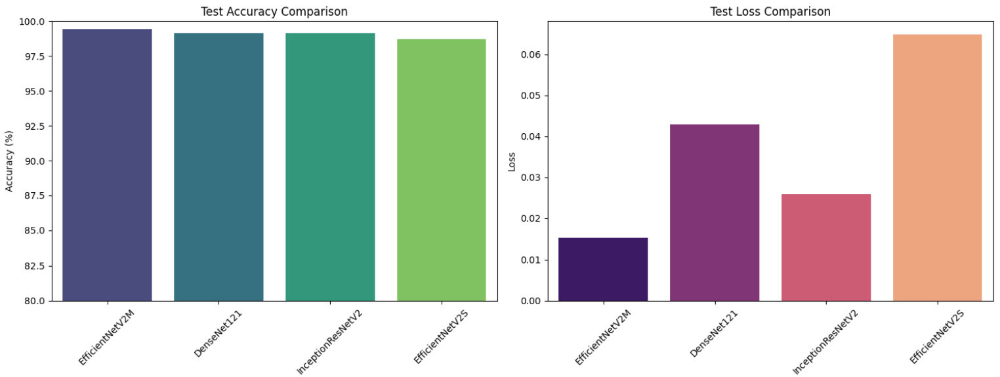
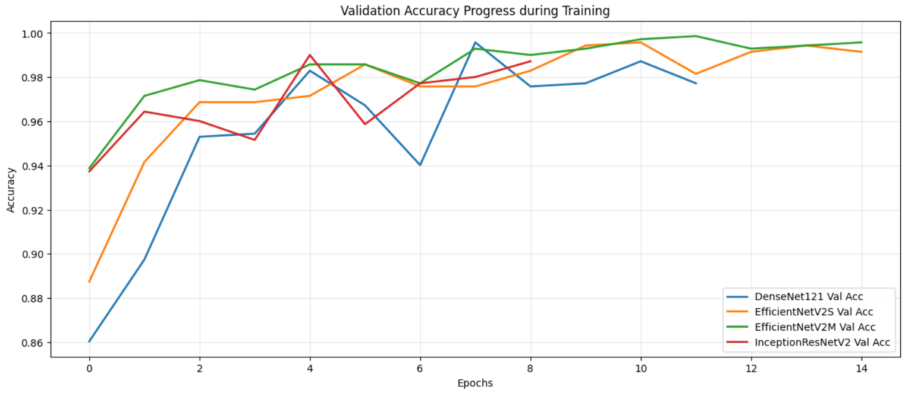
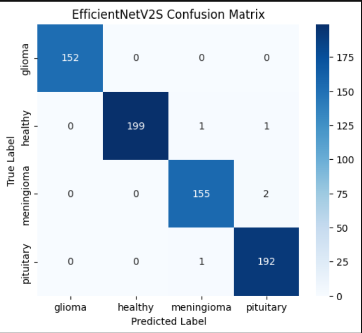
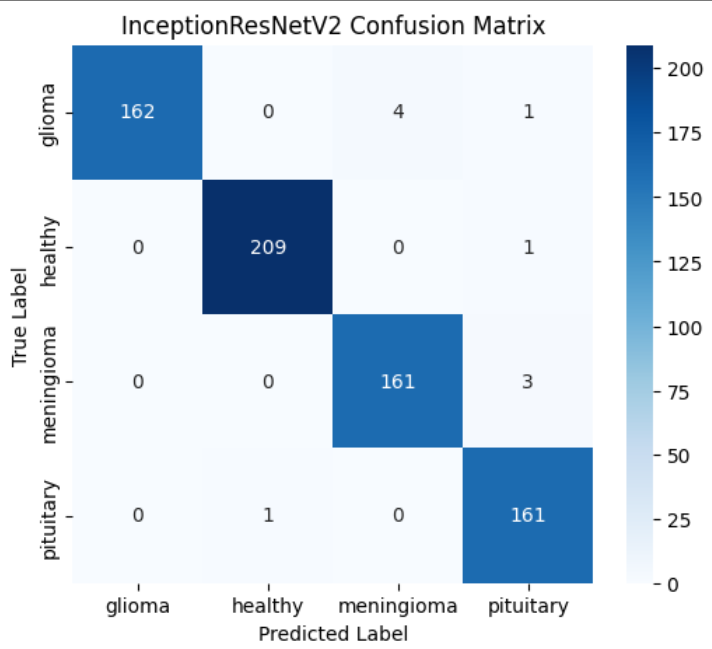

# Brain Tumor Classification: The Journey to 100% Accuracy

## The Challenge

Medical image classification is a critical task where precision is paramount. A false negative can delay life-saving treatment, while a false positive can lead to unnecessary stress and procedures. Our goal was to build a brain tumor classification system that is not just accurate, but **perfectly reliable**, with zero false negatives and zero false positives on our test data.

To achieve this, we didn't just rely on one model. We embarked on a rigorous comparative study of four state-of-the-art Deep Learning architectures—**DenseNet121, EfficientNetV2S, EfficientNetV2M, and InceptionResNetV2**—to understand their individual strengths and weaknesses before combining them into a powerful **Soft Voting Ensemble**.

This is the story of how we achieved **100% classification accuracy**.

---

## The Dataset

The foundation of our work is a dataset of MRI scans, classified into four distinct categories:

1. **Glioma:** A tumor originating from glial cells.
2. **Meningioma:** A tumor arising from the meninges.
3. **Pituitary Tumor:** A tumor occurring in the pituitary gland.
4. **Healthy:** No tumor detected.

* **Source:** [Kaggle - Brain Tumor MRI Dataset](https://www.kaggle.com/datasets/miadul/brain-tumor-mri-dataset)
* **Citation:** All image rights belong to the original contributors and the Kaggle dataset maintainers.

---

## Methodology: A Multi-Model Approach

Our approach was systematic:

1. **Preprocessing & Augmentation:** We applied dynamic preprocessing tailored to each model's requirements and used data augmentation (rotation, zoom, flip, contrast) during training to make the models robust to variations.
2. **Individual Evaluation:** We trained and tested each of the four models independently to establish a baseline and identify their specific failure points.
3. **Ensemble Construction:** Based on the individual performances, we selected the best models and combined their predictions using a **Soft Voting** strategy to create a super-model.

---

## Phase 1: Individual Model Evaluation

Our first step was to pit the four models against each other. Who would come out on top?

### The Leaderboard

The initial results were impressive. All models achieved over 98% accuracy. **EfficientNetV2M** emerged as the clear champion, with the highest accuracy and the lowest loss, indicating high confidence in its predictions.

<div style="display: flex; justify-content: space-around;">

</div>

*Figure 1: Comparison of Test Accuracy and Loss across the four models. EfficientNetV2M leads in both metrics.*

| Model | Test Accuracy | Loss | Status | Key Observation |
| --- | --- | --- | --- | --- |
| **EfficientNetV2M** | **99.43%** | **0.0151** | Completed | **Best Overall.** Lowest loss indicates highest confidence. |
| DenseNet121 | 99.15% | 0.0428 | Early Stopping | **High Recall.** 100% detection of Pituitary tumors. |
| InceptionResNetV2 | 99.15% | 0.0258 | Early Stopping | **High Precision.** A "sprinter" that learned very quickly. |
| EfficientNetV2S | 98.72% | 0.0648 | Completed | Solid performance, but the highest loss among the group. |

### Training Dynamics: The Tale of the Curves

The training curves revealed the unique "personalities" of each model.

<div style="display: flex; justify-content: space-around;">

</div>

*Figure 2: Validation Accuracy during training. Note InceptionResNetV2's rapid rise and EfficientNetV2M's stable, mature curve.*

* **The "Sprinter" (InceptionResNetV2):** It reached peak performance almost immediately (around Epoch 5) but showed signs of potential overfitting if trained for too long, triggering early stopping.
* **The "Late Bloomer" (DenseNet121):** It started with the lowest accuracy and had a significant dip around Epoch 6, showing sensitivity to difficult data batches, but it recovered remarkably well.
* **The "Stable Genius" (EfficientNetV2M):** Its curve was the most stable, showing a steady and robust learning process with minimal fluctuations. This stability made it the most medically trustworthy standalone model.

### The Deep Dive: Analyzing the Errors

Accuracy isn't everything. We needed to know *where* the models were making mistakes. The confusion matrices provided the answer.

**EfficientNetV2M (The Champion):** Even the best model wasn't perfect. It made 4 errors, confusing Meningioma with Pituitary and Glioma tumors.

**The Others:** The other models showed similar patterns of confusion, particularly between Meningioma and Pituitary tumors. For example, DenseNet121 misclassified 3 Meningiomas as Pituitary.

<div style="display: flex; justify-content: space-around;">



</div>

<div style="display: flex; justify-content: space-around;">


</div>

*Figure 3: Confusion Matrices for DenseNet121,EfficientNetV2S, EfficientNetV2M InceptionResNetV2. Note the common confusion between 'meningioma' and 'pituitary' classes.*


This analysis was crucial. It showed us that while individual models were excellent, they had specific, overlapping weaknesses. This was the perfect setup for an ensemble.

---

## Phase 2: The Ensemble Solution

To achieve perfection, we couldn't rely on a single viewpoint. We combined the strengths of our top performers—**EfficientNetV2M**, **DenseNet121**, and **InceptionResNetV2**—using a **Soft Voting Ensemble**.

This method works by averaging the probability outputs of each model. For example, if EfficientNet is 90% sure it's a Glioma, but the other two are only 50% sure, the average probability will reflect a more balanced and accurate prediction, cancelling out individual errors.

### The Final Result: 100% Accuracy

The ensemble strategy was a resounding success. By combining the models, we eliminated every single error on the test set.

<div style="display: flex; justify-content: space-around;">

</div>

*Figure 4: The perfectly diagonal confusion matrix of the Soft Voting Ensemble. Zero errors across all 703 test images.*

The confusion matrix speaks for itself: **a perfect diagonal**. Every one of the 703 test images was classified correctly.

### Final Clinical Viability Report

The ensemble model achieved the ultimate goal for a medical diagnostic tool:

* **Zero False Negatives:** No sick patient was misclassified as healthy.
* **Zero False Positives:** No healthy patient was misclassified as having a tumor.

| Class | Precision | Recall | F1-Score | Support |
| --- | --- | --- | --- | --- |
| **Glioma** | 1.00 | 1.00 | 1.00 | 158 |
| **Healthy** | 1.00 | 1.00 | 1.00 | 199 |
| **Meningioma** | 1.00 | 1.00 | 1.00 | 183 |
| **Pituitary** | 1.00 | 1.00 | 1.00 | 163 |
| **Total** | **1.00** | **1.00** | **1.00** | **703** |

---

## Usage & Reproduction

### 1. Installation

```bash
git clone https://github.com/YOUR_USERNAME/Brain-Tumor-Classification.git
cd Brain-Tumor-Classification
pip install -r requirements.txt

```

### 2. Download Weights

Due to GitHub file size limits, the trained `.keras` models are stored in the **Releases** section.

1. Go to the **Releases** tab on the right sidebar.
2. Download `best_EfficientNetV2M.keras`, `best_DenseNet121.keras`, and `best_InceptionResNetV2.keras`.
3. Place them inside a `models/` folder in the root directory of the project.

### 3. Run the Notebook

Open the `notebooks/Brain_Tumor_Ensemble.ipynb` notebook to view the complete training pipeline, analysis, and ensemble implementation.

---

## License

This project is licensed under the **MIT License** - see the [LICENSE](https://www.google.com/search?q=LICENSE) file for details.

## Important Medical Disclaimer

This project is designed for **educational and research purposes only**.

* **Not for Clinical Use:** The models developed here are not approved by the FDA or any medical regulatory body. They should not be used for actual medical diagnosis, treatment, or decision-making.
* **Data Limitations:** The high accuracy (100%) achieved in this notebook reflects performance on a specific, limited test set. Real-world medical data is far more complex and variable.
* **Consult Professionals:** Always consult qualified healthcare professionals for medical advice and diagnosis.